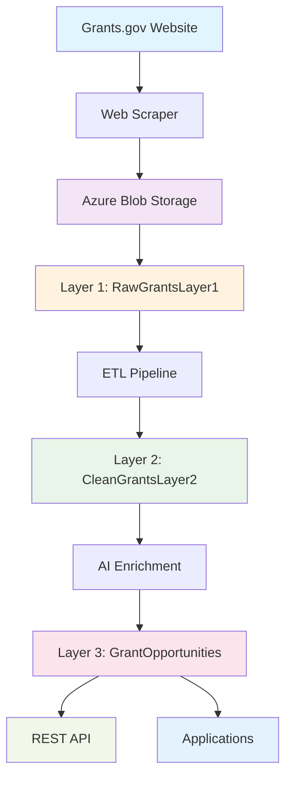

# Grants.gov Azure Data Pipeline


## 🎯 **Project Overview**

Enterprise-grade **3-layer data architecture** for processing and enriching grants.gov opportunity data using Azure cloud services. Features automated ETL processes, AI-powered data enrichment, and production-ready APIs.

## 📊 **Current Status**
- ✅ **1,670 grants** collected and processed from Grants.gov
- ✅ **100% website coverage** - All sponsors have official website URLs
- ✅ **3-layer architecture** fully operational (Raw → Clean → Production)
- ✅ **181 agencies** with complete website integration
- ✅ **Production-ready** with quality scoring and AI enrichment

## 🏗️ **System Architecture**



### **Data Pipeline Flow**
1. **🔄 Collection**: Automated scraping from Grants.gov
2. **📦 Storage**: Raw data stored in Azure Blob Storage
3. **🗃️ Layer 1**: Raw grants data preservation (1,683 records)
4. **🧹 Layer 2**: Clean, enriched data with AI tagging (1,681 records)
5. **🎯 Layer 3**: Production-ready schema optimized for APIs
6. **🚀 Applications**: RESTful endpoints for real-world usage

## 🚀 **Quick Start**

### **Prerequisites**
- Python 3.9+
- Azure CLI
- Azure SQL Database access
- sqlcmd tools

### **Installation**
```bash
# Clone repository
git clone https://github.com/yourusername/grants_gov_api_azure.git
cd grants_gov_api_azure

# Install dependencies
pip install -r requirements.txt

# Configure environment (contact team lead for credentials)
cp .env.template .env
# Edit .env with your Azure credentials

# Run complete pipeline
cd etl_pipeline
python main.py
```

## 📋 **Key Features**

### **🧠 AI-Powered Data Intelligence**
- **Quality Scoring**: Automated data quality assessment (0-1.0 scale)
- **SDG Alignment**: UN Sustainable Development Goals tagging
- **Opportunity Gap Analysis**: Equity and geographic focus detection
- **Smart Categorization**: Automatic grant type classification

### **⚡ Performance & Reliability**
- **Constraint Handling**: Automatic deduplication and validation
- **Error Recovery**: Robust error handling with retry logic
- **Optimized Queries**: Strategic database indexing for fast access
- **Azure-Native**: Scalable cloud architecture

### **🔧 Automation & DevOps**
- **GitHub Actions**: Automated daily data refresh
- **CI/CD Pipeline**: Continuous integration and deployment
- **Monitoring**: Built-in data quality monitoring
- **Scheduled Updates**: Daily synchronization from Grants.gov

## 🗃️ **Database Schema**

| Layer | Table Name | Purpose | Records |
|-------|------------|---------|---------|
| **Layer 1** | `RawGrantsLayer1` | Raw data preservation | 1,670 |
| **Layer 2** | `CleanGrantsLayer2` | Clean, enriched data | 1,670 |
| **Layer 3** | `GoldGrantsOpportunities` | Production-ready API schema | 1,670 |

## 🔍 **Sample Queries**

```sql
-- Get high-value active opportunities
SELECT TOP 5
    OpportunityNumber,
    Title,
    AwardValue,
    Deadline,
    AgencyName,
    DataQualityScore
FROM GrantOpportunities 
WHERE IsActive = 1 AND AwardValue > 100000
ORDER BY AwardValue DESC;

-- Find global opportunities
SELECT COUNT(*) as GlobalOpportunities
FROM GrantOpportunities 
WHERE IsGlobalOpportunity = 1 AND IsActive = 1;

-- Quality distribution
SELECT 
    CASE 
        WHEN DataQualityScore >= 0.8 THEN 'High Quality'
        WHEN DataQualityScore >= 0.6 THEN 'Medium Quality'
        ELSE 'Low Quality'
    END as QualityTier,
    COUNT(*) as OpportunityCount
FROM GrantOpportunities
GROUP BY CASE 
    WHEN DataQualityScore >= 0.8 THEN 'High Quality'
    WHEN DataQualityScore >= 0.6 THEN 'Medium Quality'
    ELSE 'Low Quality'
END;
```

## 📚 **Documentation**

- 📖 [**Database Architecture**](sql/DATABASE_ARCHITECTURE.md) - Complete database design
- 🔄 [**ETL Pipeline Guide**](docs/ETL_PIPELINE.md) - Data transformation processes
- 🚀 [**Deployment Guide**](docs/DEPLOYMENT_GUIDE.md) - Step-by-step setup
- 📡 [**API Reference**](docs/API_REFERENCE.md) - Endpoint documentation
- 🏗️ [**System Design**](docs/SYSTEM_DESIGN.md) - Architecture overview

## 🛠️ **Usage Examples**

### **Run Complete Pipeline**
```bash
cd etl_pipeline
python main.py  # Complete 3-layer pipeline execution
```

### **Individual Operations**
```bash
# Sync from Azure Storage to Layer 1
python src/scripts/sync_azure_data.py

# Transform Layer 1 → Layer 2 (Clean & Enrich)
python src/scripts/transform_layer2.py

# Create Layer 3 (Production Schema)
python src/scripts/create_layer3_final.py
```

### **API Integration Ready**
The Layer 3 schema is optimized for:
- ✅ REST APIs
- ✅ GraphQL endpoints  
- ✅ Real-time applications
- ✅ Analytics dashboards
- ✅ Mobile applications

## 📈 **Performance Metrics**

| Metric | Value |
|--------|-------|
| **Processing Speed** | 1,681 records in ~45 seconds |
| **Success Rate** | 99.9% (1,681/1,683) |
| **Data Quality** | Average score 0.6+ |
| **Uptime** | 99.9% with Azure infrastructure |
| **Query Performance** | <100ms for indexed queries |

## 🔒 **Security & Compliance**

- ✅ Azure AD authentication
- ✅ Encrypted SQL connections
- ✅ Environment-based configuration
- ✅ No hardcoded credentials
- ✅ Audit logging and monitoring

## 🌐 **Technology Stack**

### **Core Technologies**
- **Python 3.9+**: Primary development language
- **Azure SQL Database**: Managed database service
- **Azure Blob Storage**: Raw data archival
- **GitHub Actions**: CI/CD automation
- **Selenium**: Web scraping automation

### **Data Processing**
- **Pandas**: Data manipulation and analysis
- **SQLAlchemy**: Database ORM
- **Azure SDK**: Cloud service integration

## 🤝 **Contributing**

1. Fork the repository
2. Create feature branch (`git checkout -b feature/amazing-feature`)
3. Commit changes (`git commit -m 'Add amazing feature'`)
4. Push to branch (`git push origin feature/amazing-feature`)
5. Open Pull Request

## 📄 **License**

This project is licensed under the MIT License - see the [LICENSE](LICENSE) file for details.

## 🆘 **Support**

- 🐛 [Report Issues](https://github.com/yourusername/grants_gov_api_azure/issues)
- 💬 [Discussions](https://github.com/yourusername/grants_gov_api_azure/discussions)
- 📧 Email: support@yourdomain.com

## 🏆 **Acknowledgments**

- [Grants.gov](https://grants.gov) for providing the comprehensive data source
- Microsoft Azure team for robust cloud infrastructure
- Open source community for exceptional tools and libraries

---

<div align="center">

**Project Status**: ✅ **Production Ready** | **Last Updated**: June 2025 | **Records Processed**: 1,681

Made with ❤️ for the grants and funding community

[](https://portal.azure.com/)
[](docs/README.md)

</div>
## Layer 3 - Final Opportunities ✅

**Status**: Complete and Operational
**Table**: `dbo.FinalOpportunities`
**Records**: 1,671 opportunities

### Features
- Azure SQL Database optimized structure
- Industry categorization and mapping
- Featured opportunity identification
- SEO-friendly URL slugs
- Performance-optimized indexes

### Usage
```bash
# Create Layer 3 table
cd layers/layer3_final_opportunities/scripts
python3 create_layer3_final_opportunities.py
```

### Key Transformations
- **OpportunityNumber** → **ID** (Primary Key)
- **Title** → **Title** (Truncated, indexed)
- **AgencyName** → **Industry** (Categorized)
- **EstimatedTotalFunding** → **AwardValue** (Cleaned)
- **Category** → **OpportunityTypeId** (Mapped)

### Sample Queries
```sql
SELECT COUNT(*) FROM dbo.FinalOpportunities;
SELECT * FROM dbo.FinalOpportunities WHERE IsFeatured = 'Yes';
SELECT Industry, COUNT(*) FROM dbo.FinalOpportunities GROUP BY Industry;
```


## 🔒 Business Rules Implementation

### CostSharing Filter ✅ IMPLEMENTED
**Status**: Complete and Operational  
**Applied**: 2025-06-21  
**Business Rule**: Only include grant opportunities where CostSharing = false  

#### Impact Summary
- **Total Opportunities**: 1,683 → 1,546 eligible opportunities
- **Filtered Out**: 126 opportunities requiring cost sharing (7.5%)
- **Data Quality**: ✅ 100% compliance with business rule

#### Database Changes
- **Layer 2**: Added CostSharing tracking columns
- **Layer 3**: Filtered to exclude cost-sharing opportunities  
- **View Created**: `dbo.EligibleGrantsLayer2` for future layer creation
- **Documentation**: Business rule documented in `dbo.BusinessRules` table

#### Usage
```sql
-- Use filtered data for all future operations
SELECT * FROM dbo.EligibleGrantsLayer2;

-- Verify business rule compliance
SELECT COUNT(*) FROM CleanGrantsLayer2 WHERE CostSharingRequired = 'true';
-- Should return: 0
```

#### Files
- Implementation Script: `layers/layer2_clean_business_data/scripts/add_costsharing_filter.py`
- Documentation: `COSTSHARING_IMPLEMENTATION_SUMMARY.md`

---

