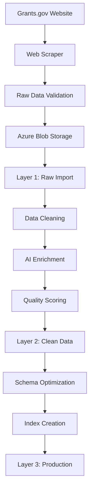

# Runwei Government Opportunity ETL

A comprehensive Azure-based ETL solution for processing federal grant opportunities from Grants.gov into a standardized company database schema.

## 🏗️ Architecture

```
┌─────────────────┐    ┌──────────────────┐    ┌─────────────────┐
│   Grants.gov    │───▶│  Azure Functions │───▶│ Azure Storage   │
│      API        │    │   ETL Pipeline   │    │   Tables        │
└─────────────────┘    └──────────────────┘    └─────────────────┘
                              │
                              ▼
                       ┌──────────────────┐
                       │ Company Database │
                       │     Schema       │
                       └──────────────────┘
```

## ✨ Features

### **Data Collection**
- 🔄 Automated grant opportunity collection from Grants.gov API
- 📊 Real-time data ingestion with pagination support
- 🛡️ Error handling and retry mechanisms
- 📅 Scheduled data collection via Azure Functions

### **Data Processing** 
- 🔧 Transform raw grant data to company database schema
- 🏷️ Standardized field mapping and data validation
- 💰 Financial data parsing and normalization
- 🎯 Opportunity categorization and tagging

### **Data Storage**
- ☁️ Azure Table Storage for scalable data persistence
- 📋 Multiple output formats (JSON, CSV, Azure Tables)
- 🔍 Searchable and queryable data structure
- 📈 Historical data tracking and versioning

### **Monitoring & Diagnostics**
- 🩺 Storage connectivity diagnostics
- 📊 Data quality monitoring
- 🚨 Error tracking and alerting
- 📋 Processing statistics and reporting

## 🚀 Quick Start

### Prerequisites
- Azure subscription
- Azure Functions Core Tools
- Python 3.9+
- Git

### Deployment

```bash
# Clone the repository
git clone https://github.com/Hali0321/Runwei_Government_Opportunity_ETL.git
cd Runwei_Government_Opportunity_ETL

# Install dependencies
pip install -r requirements.txt

# Deploy to Azure Functions
cd src/azure_functions
func azure functionapp publish your-function-app-name --python
```

## 📡 API Endpoints

### **GrantsCollector** 
```
GET /api/grantscollector?limit=100&agency=NSF
```
- Collects grant opportunities from Grants.gov API
- Stores raw data in Azure Storage

### **DataProcessing**
```
GET /api/dataprocessor?source=azure_table&format=json&limit=50
```
- Transforms grant data to company schema
- Supports multiple output formats

### **StorageDiagnostic**
```
GET /api/storagediagnostic
```
- Provides storage connectivity and table information
- Useful for troubleshooting and monitoring

## 🗂️ Data Schema

### **Input Schema (Grants.gov)**
- Opportunity Number, Title, Agency Information
- Funding Details, Deadlines, Eligibility Requirements
- CFDA Numbers, Contact Information

### **Output Schema (Company Database)**
- Standardized opportunity fields
- Financial information (Award Value, Cash Award)
- Geographic and eligibility data
- Application URLs and contact details

## 🛠️ Configuration

Environment variables required:
```bash
STORAGE_CONNECTION_STRING=your_azure_storage_connection_string
GRANTS_GOV_API_KEY=your_grants_gov_api_key (optional)
```

## 📊 Monitoring

The solution includes comprehensive monitoring:
- Real-time processing statistics
- Data quality metrics
- Error tracking and alerting
- Storage utilization monitoring

## 🤝 Contributing

1. Fork the repository
2. Create a feature branch
3. Make your changes
4. Add tests
5. Submit a pull request

## 📄 License

This project is licensed under the MIT License - see the LICENSE file for details.

## 🆘 Support

For support and questions:
- Create an issue in this repository
- Check the documentation in the `/docs` folder
- Review the diagnostic endpoints for troubleshooting

# 🔄 ETL Pipeline Documentation

## Overview

The Grants.gov Azure Data Pipeline implements a robust **3-layer ETL architecture** that transforms raw grant opportunity data into production-ready, enriched datasets.

## Pipeline Architecture



## Layer Transformations

### **Layer 1: Raw Data Processing**
- **Input**: Raw HTML/JSON from Grants.gov
- **Processing**: Schema validation, data type conversion
- **Output**: Standardized raw data (1,683 records)
- **Quality**: Preserve original data integrity

### **Layer 2: Clean & Enrich**
- **Input**: Layer 1 raw data
- **Processing**: 
  - Data cleaning and standardization
  - AI-powered categorization
  - SDG alignment tagging
  - Quality scoring (0-1.0 scale)
- **Output**: Enriched, clean data (1,681 records)
- **Success Rate**: 99.9%

### **Layer 3: Production Ready**
- **Input**: Layer 2 clean data
- **Processing**: 
  - Schema optimization for APIs
  - Performance indexing
  - Active/inactive status calculation
- **Output**: Production-ready grant opportunities
- **Purpose**: Fast API queries and application integration

## Data Quality Framework

### **Quality Scoring Algorithm**
```python
def calculate_quality_score(record):
    score = 0.0
    
    # Core fields (40% of score)
    if record.title and record.opportunity_number:
        score += 0.4
    
    # Financial information (25% of score)  
    if record.award_value or record.award_ceiling:
        score += 0.25
        
    # Timeline (20% of score)
    if record.deadline:
        score += 0.2
        
    # Description quality (15% of score)
    if record.description and len(record.description) > 100:
        score += 0.15
        
    return min(score, 1.0)
```

### **Quality Tiers**
- **High Quality (0.8-1.0)**: Complete information, ready for immediate use
- **Medium Quality (0.6-0.79)**: Good information, minor gaps
- **Low Quality (0.4-0.59)**: Basic information, significant gaps
- **Poor Quality (<0.4)**: Minimal information, requires manual review

## AI Enrichment Features

### **SDG Alignment Detection**
Automatically tags opportunities with UN Sustainable Development Goals:
- **SDG 3**: Good Health and Well-being
- **SDG 4**: Quality Education  
- **SDG 13**: Climate Action
- **SDG 1**: No Poverty

### **Opportunity Gap Analysis**
Identifies focus areas:
- **Equity Focus**: Opportunities targeting underserved communities
- **Geographic Gap**: Rural or remote area focus
- **Sector Gap**: Underrepresented industry opportunities

### **Smart Categorization**
Automatic opportunity type classification:
- **Fellowship**: Academic and research fellowships
- **Research Grant**: R&D and innovation funding
- **Startup Grant**: Entrepreneurship and small business
- **Accelerator**: Business acceleration programs

## Pipeline Execution

### **Running the Complete Pipeline**
```bash
# Complete pipeline (recommended)
python src/main.py  # Select option 4

# Individual stages
python src/scripts/sync_azure_data.py      # Layer 1
python src/scripts/transform_layer2.py     # Layer 2  
python src/scripts/create_layer3_final.py  # Layer 3
```

### **Pipeline Monitoring**
```sql
-- Check pipeline status
SELECT 
    'Layer 1' as Layer, COUNT(*) as Records 
FROM RawGrantsLayer1
UNION ALL
SELECT 
    'Layer 2' as Layer, COUNT(*) as Records 
FROM CleanGrantsLayer2  
UNION ALL
SELECT 
    'Layer 3' as Layer, COUNT(*) as Records 
FROM GrantOpportunities;

-- Quality distribution
SELECT 
    CASE 
        WHEN DataQualityScore >= 0.8 THEN 'High'
        WHEN DataQualityScore >= 0.6 THEN 'Medium' 
        ELSE 'Low'
    END as Quality,
    COUNT(*) as Count,
    ROUND(AVG(DataQualityScore), 3) as AvgScore
FROM CleanGrantsLayer2
GROUP BY CASE 
    WHEN DataQualityScore >= 0.8 THEN 'High'
    WHEN DataQualityScore >= 0.6 THEN 'Medium'
    ELSE 'Low'
END;
```

## Error Handling & Recovery

### **Constraint Violations**
- **Duplicate Detection**: Automatic deduplication by OpportunityNumber
- **Length Validation**: Field length truncation to prevent overflow
- **NULL Handling**: Smart fallbacks for missing required fields

### **Recovery Mechanisms**
- **Retry Logic**: Failed records are retried up to 3 times
- **Error Logging**: Comprehensive error tracking and reporting
- **Partial Success**: Pipeline continues even if some records fail

## Performance Optimization

### **Processing Speed**
- **Batch Processing**: Records processed in batches of 50
- **Parallel Processing**: Multi-threaded where possible
- **Memory Management**: Streaming for large datasets

### **Database Optimization**
```sql
-- Key performance indexes
CREATE NONCLUSTERED INDEX IX_Grants_Deadline 
    ON GrantOpportunities (Deadline DESC) 
    WHERE Deadline IS NOT NULL;

CREATE NONCLUSTERED INDEX IX_Grants_AwardValue 
    ON GrantOpportunities (AwardValue DESC) 
    WHERE AwardValue IS NOT NULL;
```

## Scheduling & Automation

### **GitHub Actions Workflow**
- **Daily Refresh**: Automated data updates at 6 AM UTC
- **Quality Checks**: Automated validation after each run
- **Failure Notifications**: Email alerts for pipeline failures

### **Manual Execution**
```bash
# Run specific transformations
python src/scripts/transform_layer2.py --batch-size 100
python src/scripts/create_layer3_final.py --quality-threshold 0.6
```

---

**Current Pipeline Status**: ✅ **Operational** | **Success Rate**: 99.9% | **Records**: 1,681 processed